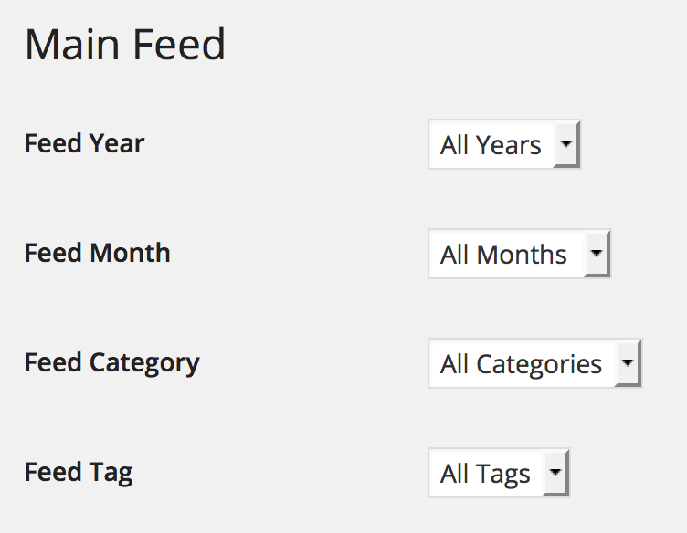

# wp-main-feed
> Apply filters on your main feed

## Usage
This plugin let's you setup default filters on your standard wordpress feed. 
For example, you could manually publish an individual archive feed under your main feed's url, i.e. `http://myblog.com/feed`.
Currently supported query vars contain `year`, `month`, `category`, `tag`.

## Screenshot

## Install

1. Upload 'main-feed' to the '/wp-content/plugins/' directory
2. Activate the plugin through the 'Plugins' menu in WordPress
3. Click on the new menu item "Main Feed" and start customizing your main feed!

